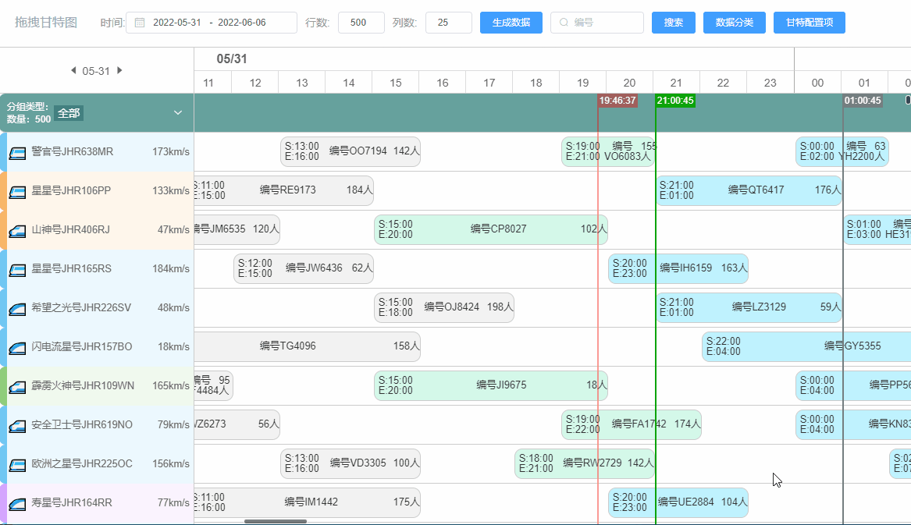
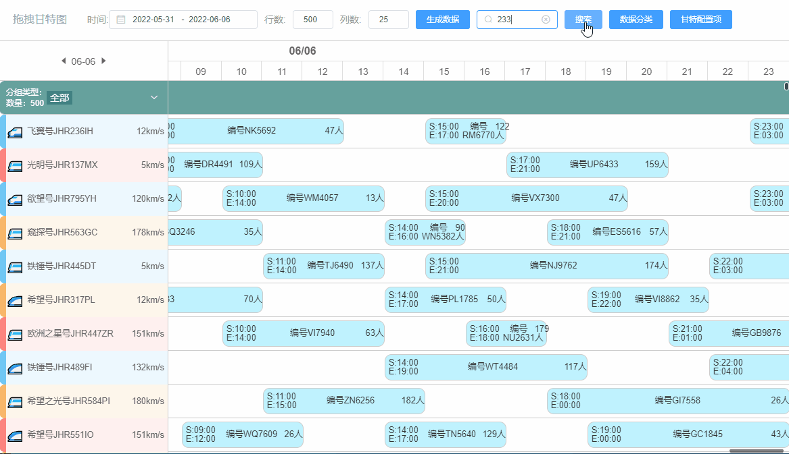

<h1 align="center">Vue3-Gantt-chart</h1>

## 

Based on [Vue3-Gantt-chart](https://github.com/w1301625107/Vue-Gantt-chart) the changes are as follows:

-  Style adjustment, adding time scale grid at the top and date on the left. The scrolling plug-in is implemented using [iscroll](https://github.com/cubiq/iscroll), which keeps the scroll bar style consistent across browsers and supports dragging with the mouse, similar to the scrolling effect on mobile phones.

-  Data search: After searching, highlight the results and scroll to the corresponding task location. If multiple results are found, continue to click the search button to jump to the next result.


### demo: [Online demo](https://liyang5945.github.io/vue-drag-gantt-chart)

### Animation demonstration
Drag and move



Search




Data format, the data of each row is as follows. The rawIndex field is the original order of each row, which is used to determine the vertical position (calculate the top value of absolute positioning). The gtArray contains the data of each small block.

```json

{
  "rawIndex": 2,
  "id": "JHR725ST",
  "type": "🚄",
  "speed": 88,
  "name": "警官号",
  "colorPair": {
    "dark": "rgb(247, 167, 71,0.8)",
    "light": "rgb(247, 167, 71,0.1)"
  },
  "gtArray": [
    {
      "id": "UM4366",
      "passenger": 40,
      "start": "Tue, 31 May 2022 21:00:28 GMT",
      "end": "Wed, 01 Jun 2022 02:00:28 GMT",
      "type": "🚄",
      "parentId": "JHR725ST"
    },
    {
      "id": "RA6062",
      "passenger": 120,
      "start": "Wed, 01 Jun 2022 06:00:28 GMT",
      "end": "Wed, 01 Jun 2022 10:00:28 GMT",
      "type": "🚄",
      "parentId": "JHR725ST"
    },
    {
      "id": "TR8476",
      "passenger": 52,
      "start": "Wed, 01 Jun 2022 15:00:28 GMT",
      "end": "Wed, 01 Jun 2022 20:00:28 GMT",
      "type": "🚄",
      "parentId": "JHR725ST"
    },
    {
      "id": "VX5715",
      "passenger": 44,
      "start": "Wed, 01 Jun 2022 23:00:28 GMT",
      "end": "Thu, 02 Jun 2022 04:00:28 GMT",
      "type": "🚄",
      "parentId": "JHR725ST"
    }
  ]
}

```
